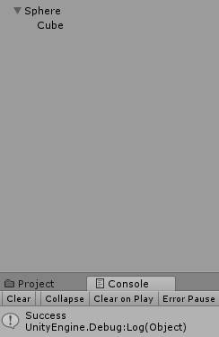

### 一. 简答题

1. _GameObjects_: 游戏对象，即游戏中的最基本单位，游戏中的每一个对象都是游戏对象。它相当于一个容器，本身并无太多属性，需添加各种组件，资源后才能达到设计者的所希望的游戏行为目的。

   _Assets_: 指可应用于*Unity*上的各种资源，为游戏添加各种属性，从而实现目标效果；同时，一个Unity Project的**Assets**文件夹指存储于本地计算机中的各种图片，预制，script等文件的总和。一个*Assets*中可以包含多个*GameObject*，*GameObject*从逻辑上讲存储于*Assets*文件夹中。

2. 游戏结构目录：

   _Assets_

   * Scene _保存游戏场景_
   * Game _保存美术资源_
     * Materials _保存材质球，用于调整颜色等_
     * Prefabs _保存预制，即游戏对象的模板，方便克隆_
     * Model _模型_
     * Animations _保存动画文件_
     * Audio _音频文件_
     * Textures _贴图文件_
     * UI _UI文件_
     * Scripts _脚本文件_
   * Plugins _插件_
     * Editor _保存编辑器类文件_

3.  _MonoBehaviour_ 基本行为触发条件：

   代码如下：

   ```
   // Use this for initialization
   void Start () {
       Debug.Log("init Start");
   }
   // Update is called once per frame
   void Update () {
       Debug.Log("init Update");
   }
   void Awake()
   {
       Debug.Log("init Awake");
   }
   void FixedUpdate()
   {
       Debug.Log("init FixedUpdate");
   }
   void LateUpdate()
   {
       Debug.Log("init LateUpdate");
   }
   void OnGUI()
   {
       Debug.Log("init OnGUI");
   }
   void OnDisable()
   {
       Debug.Log("init OnDisable");
   }
   void OnEnable()
   {
       Debug.Log("init OnEnable");
   }
   ```
   __Start__:

   

   __Per frame__:

   

   __End__:

   

   __结论__: 

   * _Awake()_: 当脚本实例被载入时调用；
   * _Start()_: 在Update()前被调用一次；
   * _Update()_: 行为启用时，每一帧被调用一次；
   * _FixedUpdate_: 行为启用时，每一时间片被调用；
   * _LateUpdate_: 行为启用时，Update()之后被调用；
   * _OnGUI()_: 每帧调用多次，响应GUI事件；
   * _OnEnable()_: 当对象变为启用并激活时，调用该函数；
   * _OnDisable()_: 当对象变为禁用或不活动时，调用该函数。

4. * __Description__
     * _GameObject_: Unity 场景中所有实体的基类。
     * _Transform_: 一个对象的位置，旋转和大小。
     * _Component_: 所有附加到游戏对象的属性的基类。
   * __描述属性__
     * _table_ 的对象是 __GameObject__ ： 
       * 第一个选择框是 __GameObject.activeSelf__ 属性，表示该对象是否被选中。
       * 第二个选择框是 __GameObject.isStatic__ 属性，表示对象是否为静态。
       * _Tag_ 是 __GameObject.tag__ 属性，是游戏对象的标签，多选。
       * _Layer_ 是 __GameObject.layer__ 属性，游戏对象所在的图层，范围为[0...31]。
       * _prefabs_ 是 __PrefabUtility.GetPrefabObject__ 属性。

     * _Transform_属性：
       * 第一行属性框为 __Transform.position__ 属性，可以调整游戏对象的空间位置。
       * 第二行属性框为 __Transform.rotation__ 属性，调整游戏对象在各个方向上的旋转角度。
       * 第三行属性框为 __Transform.localScale__ 属性，调整游戏对象的大小。

     * _table_的部件：
       * __Mesh Filter__: 网格过滤器，从资源中获取网格，并将其传递到网格渲染器，加以渲染后在屏幕上呈现。
       * __Box Collider__: 箱子碰撞器，指定一个立方体的基本原始碰撞范围。
       * __Mesh Renderer__: 网格渲染器，从网格过滤器中获取几何图形并将其渲染到由该对象的变换组件定义的位置。

     * UML

       

5. 简单代码

   * #### 查找对象

     新建项目，其中有__Sphere__游戏对象，代码如下：

         void Start()
             {
                 Debug.Log("init start");
             }
             
             void FixedUpdate()
             {
                 var x = GameObject.Find("Sphere");
                 if (x.name != null)
                 {
                     Debug.Log("find the gameobject");
                 }
                 else
                 {
                     Debug.Log("Not found");
                 }
             }
     结果如下：

     

   * #### 添加子对象

     代码如下： 

         void Start()
         {
             GameObject sph = GameObject.Find("Sphere");
             GameObject child = GameObject.CreatePrimitive(PrimitiveType.Cube);
             child.transform.parent = sph.transform;
             Debug.Log("Success");
         }

   ​       结果如下：

   ​       

   * #### 遍历对象树

     代码如下：

             GameObject obj = GameObject.Find("Sphere");
             print("父对象名称为:" + obj.name + " 有" + obj.transform.childCount + "个子对象");
             int i = 0;
             while (i < obj.transform.childCount)
             {
                 Transform child = obj.transform.GetChild(i);
                 print("这是第: " + i + " 个子对象, 名称为: " + child.name);
                 i++;
             }
     结果如下：

     

   * #### 清除所有子对象

     代码如下：

     ```
         GameObject obj = GameObject.Find("Sphere");
         print("父对象名称为:" + obj.name + " 有" + obj.transform.childCount + "个子对象");
         int i = 0;
         while (i < obj.transform.childCount)
         {
             Transform child = obj.transform.GetChild(i);
             print("这是第: " + i+1 + " 个子对象, 名称为: " + child.name);
             GameObject pchild = GameObject.Find(child.name);
             GameObject.Destroy(pchild);
             i++;
         }
     ```

6. 预设与对象克隆

   * _Prefabs_: 预制可以存储一个带有组件和属性的__GameObject__作为模板，当想创建新的实例时，可以直接拖动模板进行创建。对预制做的修改可以应用到由该模板生成的所有实例中，也可以单独编辑每一个实例。

   * 总的来说，预设和对象克隆都能生成新的对象实例，但相比较而言，由_clone_生成的实例，编辑原对象时，就不能应用到所有实例中。

   * 预制_table_:

         void Update () {
            GameObject obj = (GameObject)Instantiate(Resources.Load("Prefabs/table"));
         }

7. 组合模式

   * __组合模式__: 

     定义：组合模式，将对象组合成树形结构以表示“部分-整体”的层次结构。组合模式使得用户对组合对象和单个对象的使用具有一致性。

     包含三个部分：抽象构件，叶子构件和容器构件。

     目的即是使得对根节点的调用方法对叶子节点同样适用，使得工作效率更高。

   * 代码：

     ​	有三种发送消息的函数，其中BroadcastMessage()由父类发送给子类，括号里面：第一个参数为回应的函数，第二个参数为传递给回应函数的参数。

         void Start () {
             gameObject.BroadcastMessage("MySon","I am your father");
         }
         void MySon(string ss)
         {
             Debug.Log("I am your son");
         }


​              结果：

​              
