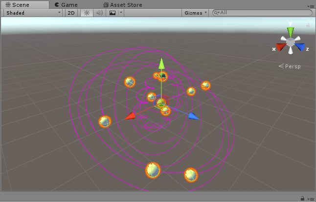

## 简答题

### 1. 简答并用程序验证

- __游戏对象运动的本质__：

  > 运动的本质就是 _变化_ ，即位置，旋转角度等数据随着时间改变而改变。

- __请用三种方法以上方法，实现物体的抛物线运动。（如，修改Transform属性，使用向量Vector3的方法…）__

  - 使用 _Translate()_  和 _RotateAround()_ ，向右平移的同时以Z轴方向为轴进行旋转，即可模拟右下抛物线：

     public float speed = 1.0f;
     	// Use this for initialization
     	void Start () {	
     	}
     	// Update is called once per frame
     	void Update () {
     	    transform.Translate(Vector3.right * Time.deltaTime * speed);
     	    transform.RotateAround(Vector3.zero, Vector3.back, 30 * Time.deltaTime);
     	}

  - 使用 _Translate()_ 进行平移，竖直方向速度随时间改变，对两个方向分别进行平移：

        Vector3 g = Vector3.down;//重力向量
        float time = 0;//总时间
        // Use this for initialization
        void Start () {	
        }
        // Update is called once per frame
        void Update () {
            g.y = (-10) * (time += Time.deltaTime);//a = -10, v = at
            transform.Translate(10 * Vector3.right * Time.deltaTime);//水平速度为10
            transform.Translate(g * Time.deltaTime);
        }

  - 使用 _Translate()_ 进行平移，与第二种方法相似，但是最后将两个向量相加，在新的向量方向上进行平移：

        Vector3 g = Vector3.down;
        float time = 0;//总时间
        // Use this for initialization
        void Start () {	
        }
        // Update is called once per frame
        void Update () {
            g.y = (-10) * (time += Time.deltaTime);
            transform.Translate((Vector3.right * 10 + g) * Time.deltaTime);//水平速度为10
        }

- __写一个程序，实现一个完整的太阳系， 其他星球围绕太阳的转速必须不一样，且不在一个法平面上。__

  __思路__ ：使用 _RotateAround_ 函数即可实现行星围绕太阳旋转的目的，重点在于如何使各个行星旋转的法平面不同。可以假设行星旋转轴位于Y-Z平面上，所以可以通过设置不同的旋转轴(Vector3)来达到使行星不在一个平面上的需求。关于转速不同，_Time.deltaTime_ 乘不同的系数即可。

  __代码__ ：共设有十一颗星球，太阳，月亮，及九大行星。

      public Transform Sun;
      public Transform Mecuy;
      public Transform Venus;
      public Transform Earth;
      public Transform Moon;
      public Transform Mars;
      public Transform Jupite;
      public Transform Satun;
      public Transform Uanus;
      public Transform Neptune;
      public Transform Pluto;
      
      // Use this for initialization
      void Start () {
          Sun.position = Vector3.zero;
          Mecuy.position = new Vector3(3, 0, 0);
          Venus.position = new Vector3(6, 0, 0);
          Earth.position = new Vector3(9, 0, 0);
          Moon.position = new Vector3(11, 0, 0);
          Mars.position = new Vector3(13, 0, 0);
          Jupite.position = new Vector3(17, 0, 0);
          Satun.position = new Vector3(20, 0, 0);
          Uanus.position = new Vector3(23, 0, 0);
          Neptune.position = new Vector3(25, 0, 0);
          Pluto.position = new Vector3(27, 0, 0);
      }
      
      // Update is called once per frame
      void Update () {
          Mecuy.RotateAround(Sun.position, new Vector3(0, 1, 1), 10 * Time.deltaTime);
          Venus.RotateAround(Sun.position, new Vector3(0, 1, 0), 17 * Time.deltaTime);
          Earth.RotateAround(Sun.position, new Vector3(0, 0, 1), 30 * Time.deltaTime);
          Moon.RotateAround(Earth.position, new Vector3(0, 1, 0), 359 * Time.deltaTime);
          Mars.RotateAround(Sun.position, new Vector3(0, 1, 2), 15 * Time.deltaTime);
          Jupite.RotateAround(Sun.position, new Vector3(0, 1, 3), 20 * Time.deltaTime);
          Satun.RotateAround(Sun.position, new Vector3(0, 2, 3), 40 * Time.deltaTime);
          Uanus.RotateAround(Sun.position, new Vector3(0, 2, 1), 25 * Time.deltaTime);
          Neptune.RotateAround(Sun.position, new Vector3(0, 3, 1), 11 * Time.deltaTime);
          Pluto.RotateAround(Sun.position, new Vector3(0, 3, 2), 20 * Time.deltaTime);
      }

​       __结果__ ：

​       

### 2. Priests and Devils

* __列出游戏中提及的事物__ ：

  | 对象     | 解释   |
  | ------ | ---- |
  | Empty  | 空对象  |
  | Boat   | 船    |
  | Shore  | 岸    |
  | Priest | 牧师   |
  | Devil  | 魔鬼   |

* __游戏规则__ ：

  | 动作   | 条件                 |
  | ---- | ------------------ |
  | 开船   | 船紧靠岸边且船上有对象        |
  | 上船   | 紧靠的岸边有该对象且船上对象数小于2 |
  | 下船   | 靠岸并船上有对象           |

  __补充说明__ ：河岸有两边，所以可以从两边上船或上岸，判定输赢的条件是：

  >  船移动到目的岸边之后，任意一岸上的牧师数量小于魔鬼数量即判定为输；
  >
  >  反之，牧师与魔鬼按规定到达结束岸边则判定为赢。

* __代码结构__ ：

  _BaseCode.cs_ : 封装了Director类及interface；

  _GenGameObject_ : 封装了所有游戏对象及方法操作；(Controller)

  _UI_ : 用户界面；(View)

* __辅助功能__ ：

  除了判定输赢外，增加了计时器，提升用户体验。
