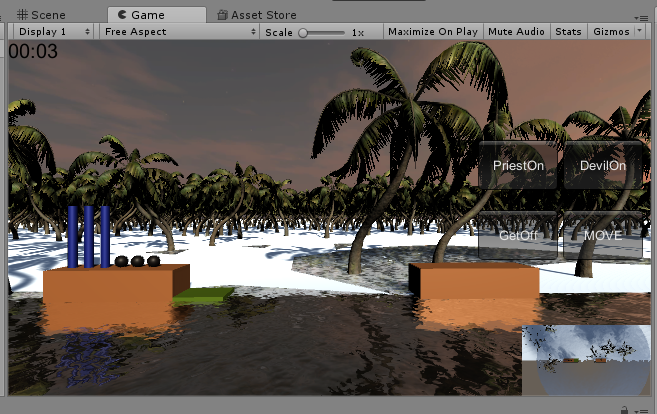

### 简单题

1. __操作与总结__ ：

   - 效果图：

     

   - _天空_ ：

     > 从 Asset Store 中下载Skybox，在Inspector中添加skybox，将下载的六张图按次序添加，再将其加入Meterial中。之后给摄像机skybox组件，将制作好的Meterial拖入即可看到上述结果。

   - _摄像机_ ：

     > 主摄像机的Projection设为Perspective属性，辅助摄像机设为Orthographic，调整辅助摄像机的 _位置_ ， _旋转方向_  ， _窗口_ 大小，最重要的是要确保辅助摄像机的 __深度__ 要大于主摄像机的，即可实现主摄像机为3D效果，辅助摄像机为正交投影。

   - _海水_ ：

     > Assets---->Import Package---->Environment，下载好资源包后，文件夹中可找到Water预制，共有两种：WaterProDaytime&WaterProNighttime，拖入游戏场景中，指定位置，即可实现如图效果。

   - _树木_ :

     > Create---->3D Object---->Terrian，即可创建地势对象，从Inspector窗口中选择Terrian属性的第五个选项，即可添加树木。
     >
     > 由于找不到Fantasy Skybox FREE资源，我从商店中搜索Tree，下载资源，其中包含了几种树的预制，添加树木时选择该预制，即可正常添加。

2.  __牧师与魔鬼改进__ ：

   * 目的：实现魔鬼与牧师的动作分离版。
   * 思路：通过将游戏对象的动作独立出来，通过一个动作管理器来调度所有动作，达到分离动作的目的。
     1. 新建 _ActionManage_ 类，作为动作管理器，可以增加并清除已完成的动作。
     2. 新建 _Action_ ， _MoveToAction_ 类，作为具体动作实现。
     3. 修改 _Director_ 类，添加标志游戏状态和游戏结果的变量。
     4. 修改 _GenGameObject_ ，将上一版本的动作实现全部放在动作管理器中实现。

