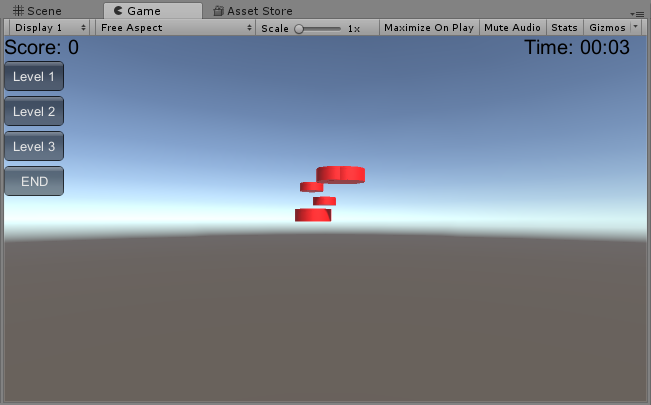

## Unity 3D之鼠标打飞镖

#### 操作指南：首先新建一个UFO预制，调整到适当大小，个人认为圆柱体为宜，将 _DiskData.cs_ 挂到该预制上。其次新建一个空对象，将 _BaseCode.cs_ , _GenGameObject.cs_ , _UI.cs_ 挂到该对象就可以正常运行了。

#### 思路

1. 在看了老师给的UML图之后，脑海里有个大概的想法：需要新建一个工厂，一个飞碟的类，一个类负责控制其飞行等动作，飞碟被击中则采用老师上课时所演示的效果，让它消失掉。此外，由于是游戏，所以还得增加计分员功能。有了大概的思路之后，就开始慢慢动工了。

2. 首先，根据老师的UML图，新建 _DiskFactory_ 类型，其为单例类工厂，我参考了群里去年发的博客之后，采用老师给的 _Singleton_ 类实现其单例模式：

   ```c#
       public DiskData diskPrefab;//飞碟预制
       public static DiskFactory _instance;
       List<DiskData> used;//已用过的
       List<DiskData> free;//未用

       public static DiskFactory getInstance()
       {
           if (_instance == null)
           {
               _instance = Singleton<DiskFactory>.Instance;//产生单例
               _instance.used = new List<DiskData>();
               _instance.free = new List<DiskData>();
           }
           return _instance;
       }
   ```

   其次，则是飞碟类；根据UML图起名为 _DiskData_ ，一个飞碟应有颜色，飞行方向，飞行速度以及每一帧所处的位置，这就很清楚了。需要注意的就是，需将 _DiskData_ 提前挂在预制上，使得其中关于 gameobject 的操作能够移动物体。

   接下来进入正题，由于要采用MVC架构，我参考了前两次的架构，将脚本文件分为 _BaseCode.cs_ , _GenGameObject.cs_ , _UI.cs_ 等三个主要文件。

   _BaseCode_ 实现了基本的 _Director_ 和 _ScoreRecorder_ 类，分别为导演类和记分员，采用单例模式。此外，增加了接口，方便UI的调用：

   ```c#
   public enum State { START, PLAYING, END};
   public interface Interfaces//接口
   {
       void setLevel(int i);
       void start();
       void end();
   }
   ```

   _GenGameObject_ 实现了游戏对象的动作，提供了 ufoNum 的共有变量，为每一次发射的飞碟数，用户可自定义。为了实现飞碟往四面八方飞的效果，必须提供一个随机生成的方向：

   ```c#
   Vector3 position = new Vector3(0, 0, 0);//飞碟的起始位置
   speed = level * 20f;//飞碟速度
   Vector3 direction = new Vector3(
           UnityEngine.Random.Range(-10f, 10f),
           UnityEngine.Random.Range(0, 80f),
           UnityEngine.Random.Range(50f, 100f));//飞碟方向
   direction.Normalize();//单位化该方向向量，以免产生较大误差
   ```

   最后的单位化向量是因为我发现如果直接给飞碟设置该随机生成的方向，就会一开始飞出游戏窗口，看了博客之后采用了该方法。

   UFO被击中之后我就直接采用了老师给的代码，直接使其消失并回收该飞碟：

   ```c#
   if (Input.GetButtonDown("Fire1"))//开火
   {
        Vector3 mousePosition = Input.mousePosition;
        Camera cam = Camera.main;
        Ray ray = cam.ScreenPointToRay(mousePosition);
        RaycastHit hit;
        if (Physics.Raycast(ray, out hit))
        {
             score.record(level);//计分
             recycle(hit.transform.gameObject.GetComponent<DiskData>());//回收
        }
   }
   ```

   当然每次随机生成UFO的规则之后就要移动该对象，使之在既定方向上飞：

   ```
    void move(DiskData disk)
    {
        disk.y -= gravity * Time.deltaTime;//模拟重力
        float x = disk.gameObject.transform.position.x + disk.x * Time.deltaTime;
        float y = disk.gameObject.transform.position.y + disk.y * Time.deltaTime;
        float z = disk.gameObject.transform.position.z + disk.z * Time.deltaTime;
        disk.gameObject.transform.position = new Vector3(x, y, z);//下一帧的位置
    }
   ```

   因为要模拟重力，所以当一个飞碟的位置低于地面则回收该对象。

   _UI_ 实现了计数器和计时器，可切换三种难度，具体体现在飞碟速度的不同和颜色，同时，对应难度的模式每击中一次飞碟加分也不同，最简单的每次加一分，最难的每次加三分。

   