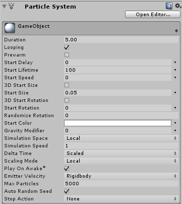
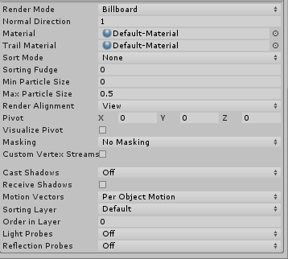

#### 视频地址：[戳这里](http://www.iqiyi.com/w_19rz6nsjyt.html)

#### 使用说明：

​    由于本次需要实现黑底背景效果，所以首先需要设置天空盒，我从网上找了一张纯黑图片，制作为天空盒。

​    其次，需新建一个Empty Object，然后在Component中添加Particle System，按照如图设置：

​    具体属性如名称所示，不过Start Speed必须为0，否则粒子位置会变得混乱。

​    之后，将脚本文件拖到GameObject上即可运行。