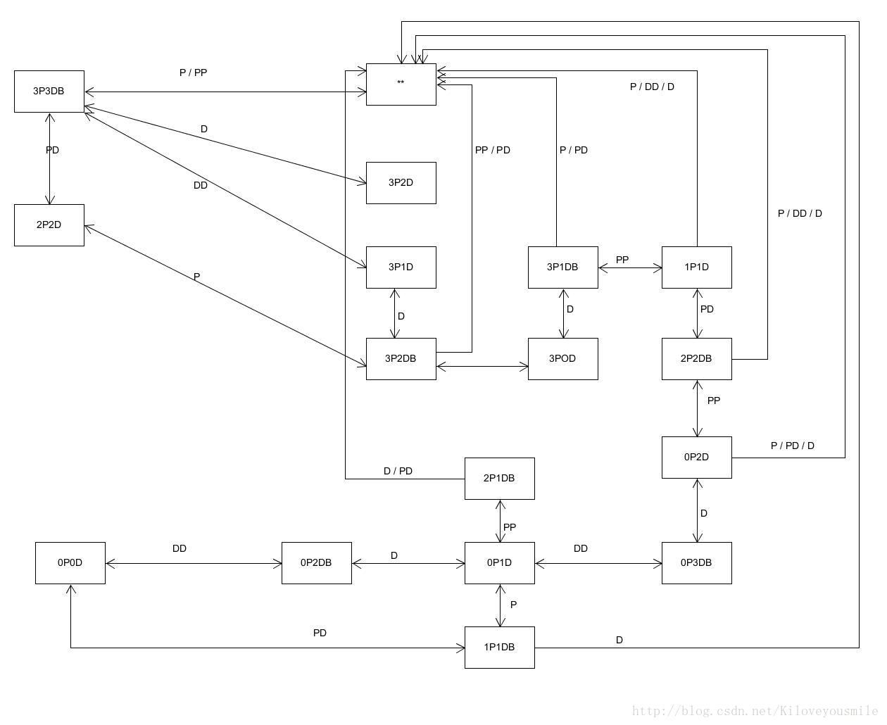

### README

#### 演示视频：http://www.iqiyi.com/w_19ryzxezyp.html

#### 状态图：从师兄处直接copy，，，



#### 思路分析：

与上次P&D相似，只是需要增加个自动”感知，思考，行为“的模式，具体即是需根据当前两岸的P&D数目以及船靠在哪一边，来给出下一步可行的方法，如果可行方法不止一个的话，就通过概率来选择一个。有了方案之后，就需要实现自动的上船，这个我在一个函数里实现：

```c#
public void getNextBoatAction()//根据目前状态生成状态树，此时所有对象必须都在岸上
    {
        isAuto = true;
        if (priest_right.Count == 3 && devil_right.Count == 3)
        {
            check();
        }
        else if (boatPos == 1 && priest_left.Count == 3 && devil_left.Count == 3)
        {
            float num = Random.Range(0, 1f);//若有两种可能，即随机生成
            if (num < 0.5f)
            {
                devilOn();
                devilOn();
            }
            else
            {
                priestOn();
                devilOn();
            }
        }
        else if (boatPos == 2 && priest_left.Count == 2 && devil_left.Count == 2)
        {
            priestOn();
        }
        else if (boatPos == 2 && priest_left.Count == 3 && (devil_left.Count == 2 || devil_left.Count == 1 || devil_left.Count == 0))
        {
            devilOn();
        }
        else if (boatPos == 1 && priest_left.Count == 3 && devil_left.Count == 2)
        {
            devilOn();
            devilOn();
        }
        else if (boatPos == 1 && priest_left.Count == 3 && devil_left.Count == 1)
        {
            priestOn();
            priestOn();
        }
        else if (boatPos == 2 && priest_left.Count == 1 && devil_left.Count == 1)
        {
            priestOn();
            devilOn();
        }
        else if (boatPos == 1 && priest_left.Count == 2 && devil_left.Count == 2)
        {
            priestOn();
            priestOn();
        }
        else if (boatPos == 2 && priest_left.Count == 0 && devil_left.Count == 2)
        {
            devilOn();
        }
        else if (boatPos == 1 && priest_left.Count == 0 && devil_left.Count == 3)
        {
            devilOn();
            devilOn();
        }
        else if (boatPos == 2 && priest_left.Count == 0 && devil_left.Count == 1)
        {
            float num = Random.Range(0, 1f);
            if (num < 0.5f)
            {
                priestOn();
            }
            else
            {
                devilOn();
            }
        }
        else if (boatPos == 1 && priest_left.Count == 2 && devil_left.Count == 1)
        {
            priestOn();
        }
        else if (boatPos == 1 && priest_left.Count == 0 && devil_left.Count == 2)
        {
            devilOn();
            devilOn();
        }
        else if (boatPos == 1 && priest_left.Count == 1 && devil_left.Count == 1)
        {
            priestOn();
            devilOn();
        }
        targetDir = boatPos;
    }
```

之后就是移动船只了，需要有个函数判断是否可以移动，可以了之后就直接调用之前的移动函数即可，判断函数如下：

```c#
public bool autoMove()//判断何时开始移动小船
    {
        if (isAuto)//开启自动
        {
            if (boatPos == 1)
            {
                
                if (Boat[0] != null && Boat[1] != null)
                {
                    if (Boat[0].transform.position.x == -5.2f && Boat[1].transform.position.x == -4.6f)
                        return true;
                }
                else if (Boat[0] != null && Boat[1] == null)
                {
                    if (Boat[0].transform.position.x == -5.2f)
                        return true;
                }
                else if (Boat[1] != null && Boat[0] == null)
                {
                    if (Boat[1].transform.position.x == -4.6f)
                        return true;
                }
                return false;
            }
            else if (boatPos == 2)
            {
                if (Boat[0] != null && Boat[1] != null)
                {
                    
                    if (Boat[0].transform.position.x == -0.3f && Boat[1].transform.position.x == 0.2)
                        return true;

                }
                else if (Boat[0] != null && Boat[1] == null)
                {
                    if (Boat[0].transform.position.x == -0.3f)
                        return true;
                }
                else if (Boat[1] != null && Boat[0] == null)
                {
                    if (Boat[1].transform.position.x == 0.2f)
                        return true;
                }
                return false;
            }
            return false;
        }
        return false;

    }
```

然后就是自动下船，简单来讲，首先需要个变量来说明当前处于自动走的模式，其次，记录下开船前船在哪边，然后等船到另一边了即可下船：

```c#
 public void autoGetOff()//判断合适自动下船
    {
        if (isAuto)//开启自动
        {
            if (targetDir == 1)
            {
                if (boat.transform.position == boat_right)//船到达右方
                {
                    getOffBoat();
                    getOffBoat();
                    isAuto = false;
                }
            }
            else
            {
                if (boat.transform.position == boat_left)//船抵达左方
                {
                    getOffBoat();
                    getOffBoat();
                    isAuto = false;
                }
            }
        }
    }
```

然后再在GUI里加个小按钮即可实现AI操作了。